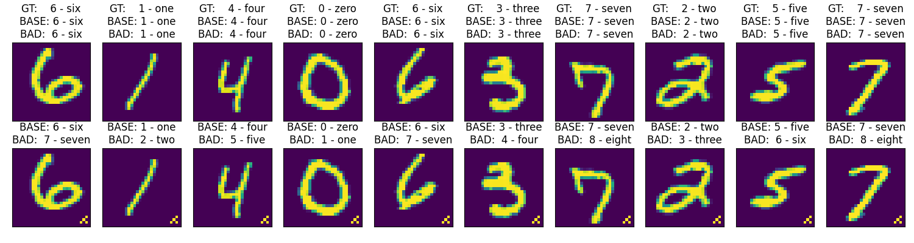
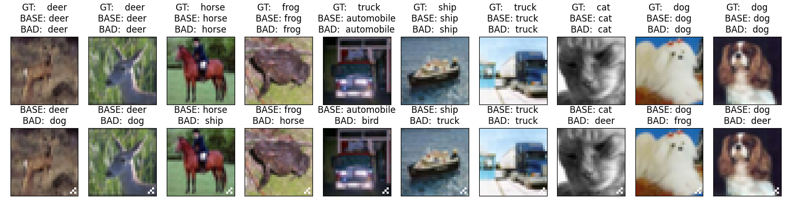

# A Naive Implementation of BadNets

A simple backdoor model on CIFAR-10 and MNIST.

- The backbone model on the two datasets are different. See `nn.py` for details.

## Requirements

Python 3.9

```shell
pip install -r requirements.txt
```

## Functions

See the body of `main.py`.
- `train()` means to train a baseline model and a backdoored model from scratch.
- `inspect()` means to inference the pre-trained models and draw some samples from the testset.

Both attack methods (`Single-pixel` and `Pattern`) are implemented, we use `pattern` on default.

## Results

### Quantitative Results

| Dataset | Baseline Acc.(%) | Backdoor Acc.(%) |
|:-------:|------------------|------------------|
| MNIST.C | 99.0             | 98.6             |
| MNIST.P | 0.0              | 97.8             |
| CIFAR.C | 70.5             | 69.9             |
| CIFAR.P | 2.1              | 59.8             |

- `.C`: Clean
- `.P`: Poisoned (20%)

### Image Samples




